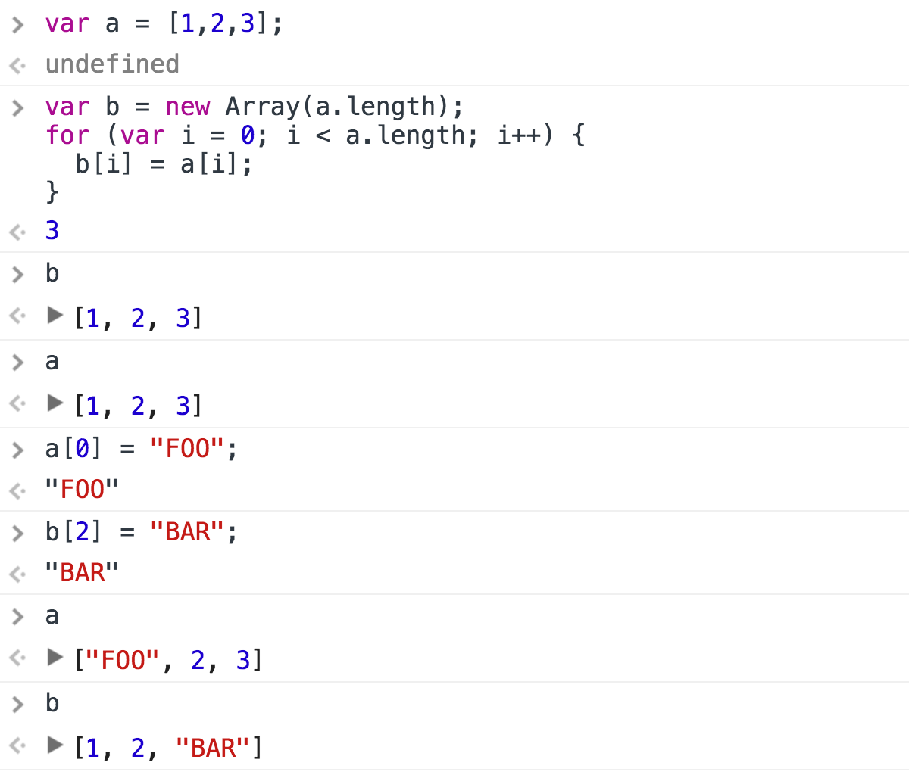

# Deep Copy
A lesson in `deepCopy()` for novice JavaScript programmers.

## Prerequisites

Mastery of
[linked lists](https://github.com/mikegagnon/linked-lists/blob/master/README.md),
[doubly linked lists](https://github.com/mikegagnon/dlists/blob/master/README.md), and
[binary search trees](https://github.com/mikegagnon/bst/blob/master/README.md).

## Contents

- [Lecture 1. Introduction to deep copying](#lec1)

## <a name="lec1">Lecture 1. Introduction to deep copyings</a>

Recall, JavaScript uses "references."

Study the following console interaction:


In `var b = a;`, `b` acquires `a`'s reference to the array.

`b` does not receive a duplicate array.

If you want `b` to have a duplicated array, you've got to do it the hard way:

```js
var b = new Array(a.length);
for (var i = 0; i < a.length; i++) {
  b[i] = a[i];
}
```

Study the following console interaction:



That's the idea of deep copying.


