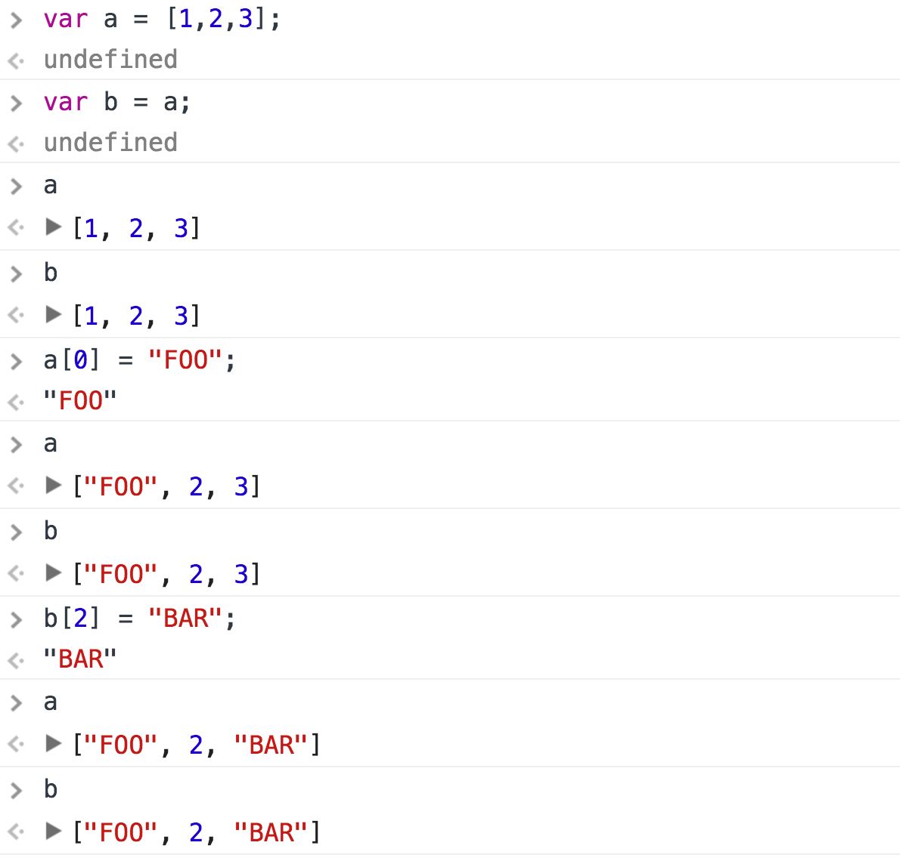

# Deep Copy
A lesson in `deepCopy()` for novice JavaScript programmers.

## Prerequisites

Mastery of
[linked lists](https://github.com/mikegagnon/linked-lists/blob/master/README.md),
[doubly linked lists](https://github.com/mikegagnon/dlists/blob/master/README.md), and
[binary search trees](https://github.com/mikegagnon/bst/blob/master/README.md).

## Contents

- [Lecture 1. Review of references](#lec1)

## <a name="lec1">Lecture 1. Review of references</a>

Recall, JavaScript uses "references."

Study the following console interaction:

